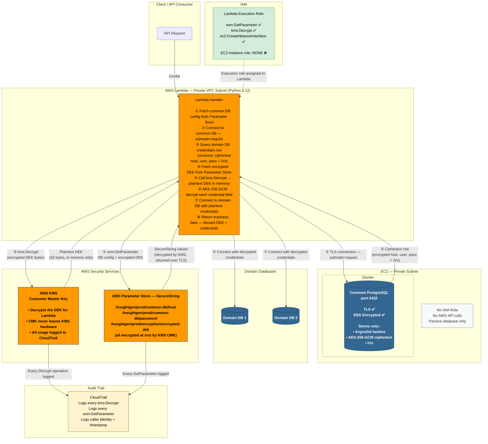

# Secure PostgreSQL Architecture on AWS EC2
### Production-Grade Design for Sensitive Data Handling

> **Scope:** PostgreSQL in Docker on EC2 · AWS Lambda (Python 3.12) · AWS KMS · AWS Parameter Store (SecureString only)
> **Goal:** Securely store domain database credentials in a common database, retrieve and decrypt them in Lambda, and connect to domain databases.

---

## Table of Contents

1. [Use Case & Architecture Overview](#1-use-case--architecture-overview)
2. [Core Concepts](#2-core-concepts)
3. [System Design](#3-system-design)
4. [AWS-Based Architecture](#4-aws-based-architecture)
5. [Architecture Diagram](#5-architecture-diagram)
6. [Implementation Guide](#6-implementation-guide)
7. [Testing & Validation](#7-testing--validation)

---

## 1. Use Case & Architecture Overview

### What We Are Building

This system has **two types of databases** with clearly different roles:

```
┌─────────────────────────────────────────────────────────────────┐
│  COMMON DATABASE  (PostgreSQL in Docker on EC2)                  │
│                                                                   │
│  Purpose: Stores credentials (host, username, password, etc.)    │
│           for various domain databases                            │
│                                                                   │
│  What it holds:                                                   │
│  • domain_db_credentials table                                    │
│  • Passwords → stored AES-256-GCM encrypted (must be readable)  │
│  • All sensitive fields → stored as AES-256-GCM ciphertext       │
│  • App user passwords → stored as Argon2id hash (never readable) │
└─────────────────────────────────────────────────────────────────┘
                              ↓
              Lambda fetches + decrypts credentials
                              ↓
┌─────────────────────────────────────────────────────────────────┐
│  DOMAIN DATABASES  (one or many — on any reachable host)         │
│                                                                   │
│  Purpose: Actual business data databases                          │
│  Lambda connects to these using credentials                       │
│  retrieved and decrypted from the common database                 │
└─────────────────────────────────────────────────────────────────┘
```

### The End-to-End Flow

```
Step 1:  Lambda starts → fetches common DB connection config
         from Parameter Store (SecureString)

Step 2:  Lambda connects to the Common Database over TLS (sslmode=require)

Step 3:  Lambda queries the common DB for the domain DB credentials row
         → DB returns: encrypted host, encrypted username,
                        encrypted password, their IVs

Step 4:  Lambda fetches the encrypted DEK from Parameter Store
         → calls KMS to decrypt the DEK into a plaintext key
         → uses that key to AES-256-GCM decrypt each credential field

Step 5:  Lambda connects to the Domain Database using the decrypted credentials

Step 6:  Lambda retrieves the requested business data and returns it to the caller
```

### What the EC2 Instance Does (and Does NOT Do)

The EC2 instance runs PostgreSQL inside a Docker container. That is its **only job**.

**The EC2 instance does NOT:**
- Call AWS Parameter Store
- Call AWS KMS
- Need an IAM role or instance profile

The PostgreSQL process accepts incoming TLS connections, stores data, and returns query results. It is a passive data store. All intelligence — fetching secrets, encrypting, decrypting — lives entirely inside the Lambda function.

> **Why no IAM role on EC2?**
> IAM roles on EC2 are needed only when code running on that EC2 makes AWS API calls (e.g., reading from S3, calling SSM, invoking KMS). PostgreSQL makes no AWS API calls. Attaching an IAM role to EC2 when it is not needed would violate least-privilege and expand the blast radius if the instance were ever compromised. Since the application layer is Lambda, the IAM execution role belongs to Lambda — not EC2.

### What Is Already in Place

The following are **already configured** on your PostgreSQL setup and require no further action:

| Layer | Status | What It Means |
|---|---|---|
| **Encryption in transit** | ✅ Already configured | All connections to PostgreSQL use TLS. Network sniffing cannot expose data in motion. |
| **Encryption at rest** | ✅ Already configured (EBS volume-level) | The entire disk where PostgreSQL writes its data files is encrypted by AWS. Someone with physical access to the EBS volume cannot read the data files. |
| **sslmode** | ✅ Set to `require` | Lambda will only open a connection if the server presents a TLS handshake. A non-TLS connection is refused by the client side. |

> **Note on `sslmode=require` vs `verify-ca` / `verify-full`:**
> `sslmode=require` ensures the connection is encrypted but does **not** verify the server's certificate against a certificate authority. For a private VPC setup where Lambda and EC2 are in the same network and access is controlled at the Security Group level, `require` is a reasonable and common choice. `verify-full` adds protection against a man-in-the-middle attack even inside the VPC but requires you to provision a CA certificate into the Lambda deployment package. Both are valid — your current `require` setting is fine for this architecture.

---

## 2. Core Concepts

### 2.1 Hashing vs Encryption — When to Use Each

These are fundamentally different operations and must not be used interchangeably.

| Property | Hashing | Encryption |
|---|---|---|
| **Reversible?** | ❌ No — one-way only | ✅ Yes — with the correct key |
| **Use case** | Passwords that only need to be verified | Credentials that must be read back as plaintext |
| **Key required?** | No | Yes |
| **Output** | Fixed-length digest | Variable ciphertext + IV |
| **Algorithm examples** | Argon2id, bcrypt | AES-256-GCM |

**The decision rule for your use case:**

- **Application user passwords → Hash (Argon2id).**
  When a user logs in, you hash what they typed and compare it to the stored hash. You never need the original password — only to verify equality. Even if the database is breached, an attacker gets only the hash, which cannot be reversed.

- **Domain database passwords → Encrypt (AES-256-GCM).**
  Lambda needs to open a TCP connection to a domain database, which requires the actual plaintext password. You cannot use hashing here because there is no way to recover the original from a hash. Encryption is the correct tool because it is designed to be reversed — with the right key.

---

### 2.2 Argon2id — Password Hashing in Depth

Argon2id won the Password Hashing Competition (2015) and is the current global standard for storing passwords.

**Why not MD5, SHA-256, or even bcrypt?**

MD5 and SHA-256 are designed for speed — a GPU can compute billions of them per second. That is catastrophically bad for passwords. An attacker with a GPU cluster can brute-force a SHA-256 hashed password database in hours.

Argon2id is intentionally slow and memory-hard. It requires a configurable amount of RAM per hash attempt (e.g., 64MB). A GPU cannot run thousands of parallel Argon2id attempts because each one consumes 64MB of VRAM. This makes brute-force attacks economically infeasible.

**What the stored hash string looks like:**
```
$argon2id$v=19$m=65536,t=3,p=2$<base64-encoded-salt>$<base64-encoded-hash>
```

This single string is self-describing — it encodes the algorithm, version, all parameters, and the salt. You store only this string in the database. You need nothing else to verify the password later.

**Parameters used in this guide:**
- `m=65536` — 64MB of RAM required per hash
- `t=3` — 3 iterations of the algorithm
- `p=2` — 2 parallel threads

These are tuned to run in approximately 200–400ms on modern hardware — imperceptible to a user, but devastating to an attacker trying millions of guesses.

> **Lambda memory note:** Argon2id's `memory_cost=65536` (64MB) requires the Lambda function to be allocated at least 128MB of memory. If your Lambda is constrained to 128MB for other reasons, reduce to `memory_cost=32768` (32MB). At 256MB Lambda allocation, keep the full 64MB.

---

### 2.3 AES-256-GCM — Authenticated Encryption in Depth

AES-256-GCM is the industry standard for symmetric encryption of data fields.

**Why GCM mode specifically?**

GCM (Galois/Counter Mode) provides **authenticated encryption** — two guarantees in one operation:

1. **Confidentiality** — the ciphertext reveals nothing about the plaintext without the key
2. **Integrity** — if anyone modifies the ciphertext (even a single byte), decryption raises an `InvalidTag` error. You know immediately that the data has been tampered with.

This is better than plain AES-CBC or AES-CTR, which provide confidentiality but no tamper detection. Never use AES-ECB — it produces identical ciphertext for identical plaintext blocks, which leaks patterns.

**The IV (Initialization Vector):**

An IV is a 12-byte (96-bit) random value generated fresh for every single encryption operation. Its job is to ensure that encrypting the same plaintext twice with the same key produces two completely different ciphertexts. The IV is not secret — store it in the database alongside the ciphertext. But it must be unique per operation. Reusing an IV with the same key breaks AES-GCM's security guarantees irreversibly.

---

### 2.4 Is PostgreSQL Alone Sufficient?

No. Here is what each layer in your current setup provides and where the gaps remain:

| Layer | What You Get | What is Still Missing |
|---|---|---|
| **EBS volume encryption** | Raw data files on disk are encrypted — physical disk access exposes nothing | Does not protect data once PostgreSQL loads it into memory or returns it in a query result |
| **TLS in transit** | Network traffic between Lambda and PostgreSQL is encrypted | Does not protect data stored in the database tables |
| **PostgreSQL roles/permissions** | DB users see only what they are granted access to | Cannot enforce application-level secrets or integrate with IAM |
| **`pgcrypto` extension** | Can run encryption functions inside SQL queries | The encryption key must be passed as a SQL argument — it appears in `pg_stat_activity`, slow query logs, and monitoring tools. A compromised DB superuser or log file exposes both the key and the data simultaneously. |

**The remaining gap:** A user with direct PostgreSQL access (DB superuser, DBA, or an attacker who obtains DB credentials) can read any row in any table. Application-layer encryption with KMS-managed keys closes this gap — even a full database dump shows only ciphertext.

---

### 2.5 How the Encryption/Decryption Workflow Works

#### Write Path — Storing domain DB credentials securely

```
Caller provides plaintext credentials to Lambda
  │
  ├─► Lambda fetches encrypted DEK from Parameter Store (SecureString)
  ├─► Lambda calls kms:Decrypt → receives plaintext DEK (in memory only)
  ├─► For each sensitive field:
  │     generate random 12-byte IV
  │     AES-256-GCM encrypt(plaintext, DEK, IV) → ciphertext
  ├─► Write (ciphertext, IV) to the common PostgreSQL database
  └─► Discard plaintext DEK from Lambda memory
```

#### Read Path — Retrieving and using domain DB credentials

```
Lambda needs to connect to a domain database
  │
  ├─► Query common DB → receives (ciphertext_host, ciphertext_user,
  │                                ciphertext_pass, their IVs)
  ├─► Lambda fetches encrypted DEK from Parameter Store
  ├─► Lambda calls kms:Decrypt → receives plaintext DEK (in memory only)
  ├─► AES-256-GCM decrypt(ciphertext, DEK, IV) → plaintext host, user, password
  ├─► Open connection to domain database using plaintext credentials
  ├─► Execute query, retrieve data
  └─► Close domain DB connection; discard plaintext DEK and credentials
```

> **Key principle:** The plaintext DEK and plaintext credentials exist only in Lambda's memory, for the duration of the invocation. They are never written to disk, never logged, and never stored back in the database.

---

## 3. System Design

### 3.1 Layered Security Model

```
┌──────────────────────────────────────────────────────────────────┐
│  AWS Lambda (Python 3.12)  — Application Layer                    │
│                                                                    │
│  All cryptographic operations live here:                          │
│  • Fetch encrypted DEK from Parameter Store                       │
│  • Call KMS to decrypt the DEK                                    │
│  • Encrypt sensitive fields before writing to common DB           │
│  • Decrypt sensitive fields after reading from common DB          │
│  • Hash app user passwords (Argon2id) before storage             │
│  • Connect to domain databases using decrypted credentials        │
│                                                                    │
│  IAM execution role:  ssm:GetParameter + kms:Decrypt only        │
├──────────────────────────────────────────────────────────────────┤
│  Common PostgreSQL DB  (Docker on EC2)  — Storage Layer           │
│                                                                    │
│  • Stores only: Argon2id hashes and AES-256-GCM ciphertext       │
│  • Never sees: plaintext passwords, plaintext credentials         │
│  • Never sees: encryption keys at any point                       │
│  • TLS on all connections  ✅  EBS encrypted at rest  ✅         │
│  • Least-privilege DB role for the Lambda connection              │
│                                                                    │
│  EC2 IAM instance role: NONE — EC2 makes no AWS API calls        │
├──────────────────────────────────────────────────────────────────┤
│  AWS Parameter Store (SecureString) + KMS  — Key Management       │
│                                                                    │
│  • All secrets stored as SecureString encrypted by the CMK        │
│  • The encrypted DEK stored here — Lambda fetches it at runtime   │
│  • KMS holds the CMK — it never leaves KMS hardware              │
│  • CloudTrail logs every kms:Decrypt call made by Lambda          │
└──────────────────────────────────────────────────────────────────┘
```

---

### 3.2 Field Classification — Common Database

| Field | What It Is | How It Is Stored | Reason |
|---|---|---|---|
| `db_password` | Domain DB password | **Encrypted (AES-256-GCM)** | Lambda must use it to open a real connection — must be recoverable |
| `db_host` | Domain DB hostname/IP | **Encrypted (AES-256-GCM)** | Sensitive infrastructure info |
| `db_username` | Domain DB username | **Encrypted (AES-256-GCM)** | Sensitive credential |
| `db_name` | Database name | **Encrypted (AES-256-GCM)** | Infrastructure info — encrypt for consistency |
| `db_port` | Port number | Plaintext | Low sensitivity — port numbers are not secrets |
| `db_engine` | Database type | Plaintext | Not sensitive |
| `app_user.password` | App user login password | **Hashed (Argon2id)** | Never needs to be recovered — only verified |
| `label` / `description` | Human-readable name | Plaintext | Not sensitive |
| `created_at` | Timestamp | Plaintext | Not sensitive |

---

### 3.3 Why Encryption Happens in Lambda, Not in PostgreSQL

Lambda is the correct and only place for all cryptographic operations. Here is the full explanation:

**1. Key isolation.** Lambda fetches the DEK from Parameter Store over an AWS API call authenticated by its IAM role. PostgreSQL never sees the key at any point. If the database is breached, an attacker gets ciphertext and IVs — useless without the DEK, which lives in a completely separate system (Parameter Store + KMS).

**2. `pgcrypto` is unsafe for this purpose.** `pgcrypto` requires you to pass the encryption key as a function argument inside the SQL query:
```sql
-- This is what pgcrypto requires — the key appears in the query
SELECT pgp_sym_decrypt(ciphertext, 'your-secret-key') FROM table;
```
That key string appears in `pg_stat_activity` (visible to any current superuser), in the PostgreSQL slow query log, and in any monitoring system that captures SQL text. The key and the data it protects coexist in the same system, in the same logs. A single log file leak exposes everything.

**3. Audit trail.** Every `kms:Decrypt` call Lambda makes is logged in CloudTrail with the Lambda function's IAM role identity, timestamp, and region. You have a tamper-proof record of every decryption event. `pgcrypto` provides no equivalent.

**4. No key rotation support in `pgcrypto`.** Rotating an encryption key with `pgcrypto` is a fully manual, ad-hoc process. With KMS and envelope encryption, you can rotate the CMK on a schedule, and re-wrapping the DEK is a single API call.

---

### 3.4 Key Management — Envelope Encryption

Envelope encryption is the AWS-native pattern for field-level encryption. Instead of using the KMS key directly on every field (slow, 4KB limit, expensive at scale), you use two tiers of keys:

```
Tier 1: KMS Customer Master Key (CMK)
─────────────────────────────────────
  • Stored in KMS hardware — never exported
  • Used ONLY to encrypt/decrypt the DEK
  • All CMK usage logged in CloudTrail
  • Rotate annually (AWS handles this automatically)

         encrypts / decrypts ↓

Tier 2: Data Encryption Key (DEK)  — AES-256 random key
─────────────────────────────────────────────────────────
  • Generated once by KMS (GenerateDataKey)
  • Encrypted form stored in Parameter Store (SecureString)
  • Lambda fetches encrypted DEK → sends to KMS → gets plaintext DEK back
  • Plaintext DEK used in Lambda to encrypt/decrypt actual field values
  • Plaintext DEK discarded after use; only the encrypted form is persisted

         encrypts / decrypts ↓

Tier 3: Field ciphertext + IV stored in PostgreSQL
────────────────────────────────────────────────────
  • The actual domain DB credential fields
  • Stored as opaque base64 ciphertext
  • PostgreSQL has no concept of what these values mean
```

**Why this pattern?**
- KMS charges per API call. Encrypting 10 fields per row directly with KMS = 10 KMS calls per write. With a DEK, it is 1 KMS call to get the DEK, then fast local AES operations for all fields.
- The CMK never leaves KMS hardware. The DEK lives in Lambda memory only for the duration of an invocation.
- To rotate: generate a new DEK, re-encrypt all stored data with it, store the new encrypted DEK in Parameter Store. The CMK does not need to change.

---

## 4. AWS-Based Architecture

### 4.1 Services Used and Their Roles

#### AWS KMS (Key Management Service)
- Hosts the **Customer Master Key (CMK)** — a 256-bit symmetric key that never leaves the KMS hardware security module
- Lambda calls `kms:Decrypt` with the encrypted DEK → KMS returns the plaintext DEK
- Supports automatic annual rotation (enable this on the CMK)
- Every call is logged in CloudTrail with full identity, timestamp, and key ID

#### AWS Parameter Store (SecureString) — for all secrets
- Stores **all** secrets: the encrypted DEK, common DB host, port, name, username, and password
- **SecureString** type: Parameter Store uses the specified KMS CMK to encrypt the value on disk. Without KMS access, stored values are unreadable
- Lambda calls `ssm:GetParameter` with `WithDecryption=True` — AWS decrypts the SecureString using KMS and returns the plaintext value to Lambda over a TLS-protected API call
- Free for standard parameters (up to 4KB per parameter, 10,000 parameters per account)
- No rotation Lambda needed for static values — update the parameter manually when credentials change

> **Why Parameter Store for everything (including the DB password) instead of Secrets Manager?**
> Secrets Manager's main differentiator is **automatic rotation** — it runs a Lambda on a schedule to rotate secrets natively (it has built-in support for RDS). For a self-managed PostgreSQL on EC2 (not RDS), the rotation Lambda must be custom-built anyway, eliminating the main advantage of Secrets Manager. Parameter Store SecureString with a CMK provides the same encryption-at-rest guarantee. Secrets Manager costs ~$0.40/secret/month plus API call fees. Parameter Store standard parameters are free. For your use case, Parameter Store is the simpler and cost-effective choice with no security compromise.

#### No IAM Role on EC2

The EC2 instance runs only PostgreSQL in Docker. PostgreSQL is a database server — it receives connections, stores data, and returns results. It makes zero AWS API calls. Therefore, no IAM instance profile should be attached to this EC2 instance.

If you attached an IAM role to EC2 "just in case," you would be giving a database server unnecessary AWS API access — a violation of least privilege that expands the attack surface if the instance is ever compromised.

---

### 4.2 Parameter Store Layout

| Parameter Path | Type | Value Stored |
|---|---|---|
| `/insightgen/prod/common-db/host` | SecureString | Private IP of the EC2 instance |
| `/insightgen/prod/common-db/port` | SecureString | `5432` |
| `/insightgen/prod/common-db/name` | SecureString | `common_db` |
| `/insightgen/prod/common-db/username` | SecureString | `app_user` |
| `/insightgen/prod/common-db/password` | SecureString | The PostgreSQL password (plaintext stored securely by SSM+KMS) |
| `/insightgen/prod/encryption/encrypted-dek` | SecureString | The AES-256 DEK encrypted by the CMK |
| `/insightgen/prod/encryption/kms-key-id` | String | The KMS CMK Key ID (not sensitive) |

---

### 4.3 IAM Role — Lambda Only

Only the Lambda function has an IAM execution role. EC2 has no role.

```json
{
  "Version": "2012-10-17",
  "Statement": [
    {
      "Sid": "ReadSecretsFromParameterStore",
      "Effect": "Allow",
      "Action": [
        "ssm:GetParameter",
        "ssm:GetParameters",
        "ssm:GetParametersByPath"
      ],
      "Resource": "arn:aws:ssm:REGION:ACCOUNT_ID:parameter/insightgen/prod/*"
    },
    {
      "Sid": "DecryptDEKWithKMS",
      "Effect": "Allow",
      "Action": [
        "kms:Decrypt",
        "kms:DescribeKey"
      ],
      "Resource": "arn:aws:kms:REGION:ACCOUNT_ID:key/CMK_KEY_ID"
    },
    {
      "Sid": "AllowVPCNetworkingToReachEC2PostgreSQL",
      "Effect": "Allow",
      "Action": [
        "ec2:CreateNetworkInterface",
        "ec2:DescribeNetworkInterfaces",
        "ec2:DeleteNetworkInterface"
      ],
      "Resource": "*"
    }
  ]
}
```

> **Why does Lambda need `ec2:CreateNetworkInterface`?**
> Lambda functions run in AWS-managed infrastructure by default and cannot reach resources inside your VPC. To allow Lambda to connect to your PostgreSQL container (which has a private IP inside your VPC), Lambda must be deployed *inside* your VPC. When you do this, AWS needs to create an Elastic Network Interface (ENI) in your VPC subnet and assign Lambda a private IP address. The three `ec2:` permissions allow the Lambda service to create, inspect, and remove that ENI automatically. Without these, Lambda cannot be placed inside the VPC and cannot reach the PostgreSQL host. These are infrastructure-level permissions for the Lambda service itself — not for your application code.

---

### 4.4 KMS Key Policy

The KMS key policy is a second, independent access control layer. Even if an IAM role allows `kms:Decrypt`, the KMS key policy must also allow it. Both must permit the action for it to succeed.

```json
{
  "Version": "2012-10-17",
  "Statement": [
    {
      "Sid": "AllowRootAccountManagement",
      "Effect": "Allow",
      "Principal": {"AWS": "arn:aws:iam::ACCOUNT_ID:root"},
      "Action": "kms:*",
      "Resource": "*"
    },
    {
      "Sid": "AllowKeyAdministration",
      "Effect": "Allow",
      "Principal": {"AWS": "arn:aws:iam::ACCOUNT_ID:role/KeyAdminRole"},
      "Action": [
        "kms:Create*", "kms:Describe*", "kms:Enable*", "kms:List*",
        "kms:Put*", "kms:Update*", "kms:Revoke*", "kms:Disable*",
        "kms:Get*", "kms:Delete*", "kms:ScheduleKeyDeletion",
        "kms:CancelKeyDeletion", "kms:EnableKeyRotation"
      ],
      "Resource": "*"
    },
    {
      "Sid": "AllowLambdaDecryptOnly",
      "Effect": "Allow",
      "Principal": {
        "AWS": "arn:aws:iam::ACCOUNT_ID:role/insightgen-lambda-execution-role"
      },
      "Action": [
        "kms:Decrypt",
        "kms:DescribeKey"
      ],
      "Resource": "*"
    }
  ]
}
```

Notice that `kms:GenerateDataKey` is deliberately **not** granted to the Lambda role. Lambda only needs to decrypt the DEK at runtime. `GenerateDataKey` is a setup-time operation performed once by an admin (you) to create the DEK. After that, no runtime code needs the ability to create new DEKs.

---

### 4.5 How Lambda Gets AWS Credentials Without Storing Them

Lambda authentication to AWS is fully automatic — no access keys, no secrets in environment variables, no files on disk.

When you assign an IAM execution role to a Lambda function:
1. AWS injects temporary STS credentials into the Lambda execution environment automatically
2. These credentials appear as environment variables (`AWS_ACCESS_KEY_ID`, `AWS_SECRET_ACCESS_KEY`, `AWS_SESSION_TOKEN`) that the Lambda runtime manages
3. `boto3` reads these automatically — you never pass credentials explicitly in code
4. The credentials are scoped exactly to the permissions in the execution role — nothing else
5. They expire and refresh automatically; your code never handles expiry

---

## 5. Architecture Diagram



### Data Flow Summary

| Step | What Happens | Where |
|---|---|---|
| **1** | Lambda fetches common DB connection config | Lambda → Parameter Store → KMS |
| **2** | Lambda opens TLS connection to PostgreSQL | Lambda → EC2:5432 |
| **3** | Lambda queries the credential row (ciphertext + IVs returned) | Lambda → PostgreSQL |
| **4** | Lambda fetches encrypted DEK | Lambda → Parameter Store |
| **5** | Lambda decrypts the DEK | Lambda → KMS |
| **6** | Lambda decrypts each credential field (AES-256-GCM) | Lambda memory only |
| **7** | Lambda connects to domain DB with plaintext credentials | Lambda → Domain DB |
| **8** | Data returned; plaintext DEK + credentials discarded | Lambda memory cleared |

---

## 6. Implementation Guide

### 6.1 Python Dependencies

```txt
# requirements.txt — package into a Lambda Layer
argon2-cffi==23.1.0
cryptography==42.0.5
boto3==1.34.0
psycopg2-binary==2.9.9
```

---

### 6.2 PostgreSQL Schema — Common Database

```sql
-- ============================================================
-- Enable UUID generation
-- ============================================================
CREATE EXTENSION IF NOT EXISTS pgcrypto;

-- ============================================================
-- Create database and least-privilege application user
-- ============================================================
CREATE DATABASE common_db;
\c common_db;

-- app_user: the DB role Lambda connects as
-- Can only read and write data — cannot alter schema
CREATE ROLE app_user WITH LOGIN PASSWORD 'SET_VIA_PARAMETER_STORE';
GRANT CONNECT ON DATABASE common_db TO app_user;

-- ============================================================
-- Domain DB credentials table
--
-- All sensitive credential fields (host, username, password) are stored
-- as AES-256-GCM ciphertext. Lambda decrypts them at runtime.
-- The database itself never holds or processes plaintext credentials.
--
-- Each field has a companion _iv column storing the 12-byte
-- Initialization Vector used during encryption. The IV is not secret —
-- it must be stored so the correct decryption can be performed later.
-- ============================================================
CREATE TABLE domain_db_credentials (
    id              UUID         PRIMARY KEY DEFAULT gen_random_uuid(),
    label           VARCHAR(100) NOT NULL UNIQUE,   -- e.g. "orders-db-prod"
    db_host_enc     TEXT         NOT NULL,           -- AES-256-GCM ciphertext of hostname
    db_host_iv      CHAR(24)     NOT NULL,           -- 12-byte IV as 24-char hex string
    db_port         INTEGER      NOT NULL DEFAULT 5432, -- Low sensitivity, stored plaintext
    db_name_enc     TEXT         NOT NULL,           -- AES-256-GCM ciphertext of DB name
    db_name_iv      CHAR(24)     NOT NULL,
    db_username_enc TEXT         NOT NULL,           -- AES-256-GCM ciphertext of username
    db_username_iv  CHAR(24)     NOT NULL,
    db_password_enc TEXT         NOT NULL,           -- AES-256-GCM ciphertext of password
    db_password_iv  CHAR(24)     NOT NULL,
    db_engine       VARCHAR(20)  NOT NULL DEFAULT 'postgresql',
    is_active       BOOLEAN      NOT NULL DEFAULT TRUE,
    created_at      TIMESTAMPTZ  NOT NULL DEFAULT NOW(),
    updated_at      TIMESTAMPTZ  NOT NULL DEFAULT NOW()
);

-- ============================================================
-- Application users table
--
-- Passwords are stored as Argon2id hashes — NEVER as plaintext.
-- Argon2id hashing is a one-way function. Even with full DB access,
-- no one can recover the original password from the stored hash.
-- ============================================================
CREATE TABLE app_users (
    id            UUID        PRIMARY KEY DEFAULT gen_random_uuid(),
    username      VARCHAR(50) NOT NULL UNIQUE,
    password_hash TEXT        NOT NULL,   -- $argon2id$v=19$... format
    created_at    TIMESTAMPTZ NOT NULL DEFAULT NOW(),
    is_active     BOOLEAN     NOT NULL DEFAULT TRUE
);

-- ============================================================
-- Audit log — records every access to sensitive credentials
-- ============================================================
CREATE TABLE access_audit (
    id            BIGSERIAL    PRIMARY KEY,
    credential_id UUID         REFERENCES domain_db_credentials(id),
    action        VARCHAR(50)  NOT NULL,  -- READ_CREDENTIAL, INSERT_CREDENTIAL, etc.
    success       BOOLEAN      NOT NULL,
    accessed_at   TIMESTAMPTZ  NOT NULL DEFAULT NOW(),
    details       JSONB
);

-- ============================================================
-- Indexes
-- ============================================================
CREATE INDEX idx_domain_creds_label  ON domain_db_credentials(label);
CREATE INDEX idx_domain_creds_active ON domain_db_credentials(is_active);
CREATE INDEX idx_audit_credential    ON access_audit(credential_id, accessed_at DESC);

-- ============================================================
-- Grant minimum necessary privileges to app_user
-- app_user can read and write data but cannot drop or alter tables
-- ============================================================
REVOKE ALL ON SCHEMA public FROM app_user;
GRANT USAGE ON SCHEMA public TO app_user;
GRANT SELECT, INSERT, UPDATE ON domain_db_credentials TO app_user;
GRANT SELECT, INSERT, UPDATE ON app_users             TO app_user;
GRANT INSERT                  ON access_audit          TO app_user;
GRANT USAGE, SELECT ON SEQUENCE access_audit_id_seq   TO app_user;
```

---

### 6.3 AWS Setup — KMS and Parameter Store

```bash
# ============================================================
# Step 1: Create a KMS Customer Master Key (CMK)
#
# This key serves two purposes:
#  a) Encrypts/decrypts the DEK (which protects DB field values)
#  b) Encrypts all SecureString values stored in Parameter Store
#
# The CMK never leaves KMS hardware — it exists only inside
# AWS KMS's hardware security modules.
# ============================================================
KMS_KEY_ID=$(aws kms create-key \
  --description "InsightGen common DB CMK" \
  --key-usage ENCRYPT_DECRYPT \
  --key-spec SYMMETRIC_DEFAULT \
  --tags TagKey=Project,TagValue=InsightGen \
  --query 'KeyMetadata.KeyId' \
  --output text)

echo "CMK Key ID: $KMS_KEY_ID"

# Create a human-readable alias for the key
aws kms create-alias \
  --alias-name alias/insightgen-cmk \
  --target-key-id $KMS_KEY_ID

# Enable automatic annual key rotation
aws kms enable-key-rotation --key-id $KMS_KEY_ID

# ============================================================
# Step 2: Generate the Data Encryption Key (DEK)
#
# kms generate-data-key returns two things:
#  - Plaintext (base64): the actual AES-256 key — use once to
#    encrypt any initial test data, then DELETE immediately
#  - CiphertextBlob (base64): the DEK encrypted by the CMK —
#    this is what gets stored in Parameter Store
#
# At Lambda runtime:
#  Lambda fetches CiphertextBlob → sends to KMS Decrypt
#  → KMS returns Plaintext DEK → Lambda encrypts/decrypts fields
# ============================================================
aws kms generate-data-key \
  --key-id alias/insightgen-cmk \
  --key-spec AES_256 \
  --output json > /tmp/dek_output.json

# Extract encrypted DEK for storage
ENCRYPTED_DEK=$(python3 -c "
import json
with open('/tmp/dek_output.json') as f:
    print(json.load(f)['CiphertextBlob'])
")

# Securely wipe the output file — the plaintext DEK in this file
# should never be stored permanently anywhere
rm /tmp/dek_output.json

# ============================================================
# Step 3: Store all secrets in Parameter Store as SecureString
#
# SecureString means: Parameter Store will encrypt the value
# using the specified KMS CMK before writing it to disk.
# Lambda retrieves it with WithDecryption=True — AWS decrypts
# it in-flight and returns the plaintext to Lambda over TLS.
#
# No secret is ever stored as plaintext at rest in SSM.
# ============================================================

# The encrypted DEK — Lambda fetches and sends to KMS at runtime
aws ssm put-parameter \
  --name "/insightgen/prod/encryption/encrypted-dek" \
  --value "$ENCRYPTED_DEK" \
  --type "SecureString" \
  --key-id "alias/insightgen-cmk" \
  --description "AES-256 DEK encrypted by CMK — Lambda decrypts via kms:Decrypt at runtime"

# Common DB connection details — all as SecureString
aws ssm put-parameter \
  --name "/insightgen/prod/common-db/host" \
  --value "10.0.1.45" \
  --type "SecureString" \
  --key-id "alias/insightgen-cmk"

aws ssm put-parameter \
  --name "/insightgen/prod/common-db/port" \
  --value "5432" \
  --type "SecureString" \
  --key-id "alias/insightgen-cmk"

aws ssm put-parameter \
  --name "/insightgen/prod/common-db/name" \
  --value "common_db" \
  --type "SecureString" \
  --key-id "alias/insightgen-cmk"

aws ssm put-parameter \
  --name "/insightgen/prod/common-db/username" \
  --value "app_user" \
  --type "SecureString" \
  --key-id "alias/insightgen-cmk"

# The DB password itself — also a SecureString, encrypted by KMS at rest
# This replaces the need for Secrets Manager for this use case
aws ssm put-parameter \
  --name "/insightgen/prod/common-db/password" \
  --value "STRONG_RANDOM_DB_PASSWORD_HERE" \
  --type "SecureString" \
  --key-id "alias/insightgen-cmk"

# Verify — list all parameters (names only, no values)
aws ssm get-parameters-by-path \
  --path "/insightgen/prod/" \
  --recursive \
  --query 'Parameters[].{Name:Name, Type:Type}' \
  --output table
```

---

### 6.4 Cryptography Module (crypto.py) — Lambda Layer

```python
# crypto.py
# Deployed as a Lambda Layer — shared across all Lambda functions
# Handles: DEK retrieval from SSM+KMS, AES-256-GCM encryption/decryption,
#          Argon2id password hashing and verification

import base64
import logging
import os
import secrets
from typing import Optional, Tuple

import boto3
from argon2 import PasswordHasher
from argon2.exceptions import VerifyMismatchError, VerificationError, InvalidHashError
from cryptography.hazmat.primitives.ciphers.aead import AESGCM

logger = logging.getLogger(__name__)
logger.setLevel(logging.INFO)

# ============================================================
# AWS Client Initialisation
#
# Clients are created once at module scope and reused across
# warm Lambda invocations. This avoids repeating the connection
# setup (DNS lookup, TLS handshake) on every invocation.
# boto3 automatically uses the Lambda execution role credentials
# injected into the environment by the Lambda runtime.
# ============================================================
_ssm_client = None
_kms_client = None


def _ssm():
    global _ssm_client
    if _ssm_client is None:
        _ssm_client = boto3.client('ssm', region_name=os.environ['AWS_REGION'])
    return _ssm_client


def _kms():
    global _kms_client
    if _kms_client is None:
        _kms_client = boto3.client('kms', region_name=os.environ['AWS_REGION'])
    return _kms_client


# ============================================================
# DEK Retrieval — the heart of the security model
#
# The plaintext DEK is cached at module level for the lifetime
# of the Lambda container (i.e., shared across warm invocations
# on the same container). This is acceptable because:
#  - Each Lambda container is an isolated microVM
#  - The DEK is never written to disk or logged
#  - AWS recycles containers after inactivity
#  - Caching avoids a KMS API call on every invocation
# ============================================================
_plaintext_dek_cache: Optional[bytes] = None


def _get_plaintext_dek() -> bytes:
    """
    Retrieve the plaintext AES-256 DEK by:

    1. Calling ssm:GetParameter (WithDecryption=True) to fetch the
       encrypted DEK. Parameter Store decrypts the SecureString using
       the CMK and returns the value to Lambda over TLS.

    2. Calling kms:Decrypt with the encrypted DEK bytes. KMS uses the
       CMK (which never leaves KMS hardware) to decrypt the DEK and
       returns 32 bytes of plaintext key material to Lambda.

    The result is cached for the container's lifetime.
    """
    global _plaintext_dek_cache
    if _plaintext_dek_cache is not None:
        return _plaintext_dek_cache

    # Step 1: Fetch the encrypted DEK from Parameter Store
    # WithDecryption=True: SSM decrypts the SecureString via KMS and
    # returns the plaintext value to Lambda. The "plaintext" here is
    # still the encrypted DEK — it has been decrypted by SSM's SecureString
    # mechanism, but it is still the KMS-encrypted DEK blob, not the actual key.
    param_name = os.environ.get(
        'ENCRYPTED_DEK_PARAM',
        '/insightgen/prod/encryption/encrypted-dek'
    )
    response = _ssm().get_parameter(Name=param_name, WithDecryption=True)
    encrypted_dek_b64 = response['Parameter']['Value']
    encrypted_dek_bytes = base64.b64decode(encrypted_dek_b64)

    # Step 2: Send the encrypted DEK bytes to KMS for decryption
    # KMS uses the CMK to unwrap the DEK and returns the 32-byte
    # plaintext AES-256 key. The CMK itself never leaves KMS.
    kms_response = _kms().decrypt(
        CiphertextBlob=encrypted_dek_bytes,
        KeyId=os.environ.get('KMS_KEY_ARN', 'alias/insightgen-cmk')
    )
    plaintext_dek = kms_response['Plaintext']  # 32 bytes

    _plaintext_dek_cache = plaintext_dek
    logger.info("Plaintext DEK retrieved from KMS and cached")
    return plaintext_dek


# ============================================================
# AES-256-GCM Field Encryption / Decryption
# ============================================================

def encrypt_field(plaintext: str) -> Tuple[str, str]:
    """
    Encrypt a sensitive string field using AES-256-GCM.

    Returns:
        ciphertext_b64 : base64-encoded ciphertext
                         (includes the 16-byte GCM authentication tag appended)
        iv_hex         : hex-encoded 12-byte IV — store this alongside the ciphertext

    A fresh cryptographically random IV is generated for every call.
    This ensures that encrypting the same value twice produces different
    ciphertext each time, preventing pattern analysis.
    """
    dek = _get_plaintext_dek()
    iv = secrets.token_bytes(12)       # 96-bit IV — the correct size for AES-GCM
    aesgcm = AESGCM(dek)
    ciphertext = aesgcm.encrypt(iv, plaintext.encode('utf-8'), None)
    return base64.b64encode(ciphertext).decode('utf-8'), iv.hex()


def decrypt_field(ciphertext_b64: str, iv_hex: str) -> str:
    """
    Decrypt a field encrypted by encrypt_field().

    If the ciphertext has been tampered with in any way — even a single
    flipped bit — this raises cryptography.exceptions.InvalidTag.
    This is AES-GCM's built-in integrity check at work.

    You should always catch InvalidTag and treat it as a security event,
    not a routine error.
    """
    dek = _get_plaintext_dek()
    iv = bytes.fromhex(iv_hex)
    ciphertext = base64.b64decode(ciphertext_b64)
    aesgcm = AESGCM(dek)
    return aesgcm.decrypt(iv, ciphertext, None).decode('utf-8')


# ============================================================
# Argon2id Password Hashing
#
# Used ONLY for application user passwords.
# Domain DB passwords are encrypted (recoverable), NOT hashed.
# Application user passwords are hashed (NOT recoverable) because
# we only ever need to verify them — never read them back.
# ============================================================

_ph = PasswordHasher(
    time_cost=3,        # 3 iterations of the algorithm
    memory_cost=65536,  # 64MB RAM per hash — use 32768 for 128MB Lambda
    parallelism=2,      # 2 parallel threads
    hash_len=32,
    salt_len=16
)


def hash_password(password: str) -> str:
    """
    Hash a password with Argon2id.

    Returns a self-describing hash string containing the algorithm,
    version, all parameters, and the embedded salt:
        $argon2id$v=19$m=65536,t=3,p=2$<salt>$<hash>

    Store this entire string as the password_hash column value.
    """
    if len(password) < 8:
        raise ValueError("Password must be at least 8 characters")
    return _ph.hash(password)


def verify_password(submitted_password: str, stored_hash: str) -> bool:
    """
    Verify a submitted password against a stored Argon2id hash.

    Always returns a boolean. Never raises on wrong password.
    Uses timing-safe comparison internally.
    """
    try:
        _ph.verify(stored_hash, submitted_password)
        return True
    except VerifyMismatchError:
        return False
    except (VerificationError, InvalidHashError) as e:
        logger.warning(f"Hash verification error (not a password mismatch): {e}")
        return False


def needs_rehash(stored_hash: str) -> bool:
    """
    Returns True if the hash was created with weaker parameters than the
    current PasswordHasher configuration. Call after a successful login.
    If True, re-hash the password and update the stored value.
    This allows gradual parameter upgrades without requiring password resets.
    """
    return _ph.check_needs_rehash(stored_hash)
```

---

### 6.5 Lambda Handler (lambda_handler.py)

```python
# lambda_handler.py
# Routes requests to: store credentials, query domain DB, signup, login

import json
import logging
import os
from typing import Any, Dict

import boto3
import psycopg2
from psycopg2.extras import RealDictCursor
from cryptography.exceptions import InvalidTag

from crypto import (
    encrypt_field, decrypt_field,
    hash_password, verify_password, needs_rehash
)

logger = logging.getLogger(__name__)
logger.setLevel(logging.INFO)

# ============================================================
# Common DB Connection
#
# Fetches all connection details from Parameter Store at cold start.
# sslmode=require: Lambda refuses to connect without TLS.
# Connection is reused across warm invocations.
# ============================================================
_common_db_conn = None


def get_common_db_connection():
    global _common_db_conn
    if _common_db_conn is not None and not _common_db_conn.closed:
        try:
            _common_db_conn.cursor().execute("SELECT 1")
            return _common_db_conn
        except Exception:
            pass  # Stale connection — fall through to reconnect

    ssm = boto3.client('ssm', region_name=os.environ['AWS_REGION'])

    def get_param(name):
        return ssm.get_parameter(
            Name=f"/insightgen/prod/common-db/{name}",
            WithDecryption=True
        )['Parameter']['Value']

    _common_db_conn = psycopg2.connect(
        host=get_param('host'),
        port=int(get_param('port')),
        dbname=get_param('name'),
        user=get_param('username'),
        password=get_param('password'),
        sslmode='require',   # Refuse plaintext connections — TLS only
        connect_timeout=5
    )
    _common_db_conn.autocommit = False
    logger.info("Common DB connection established via TLS")
    return _common_db_conn


# ============================================================
# Store Domain DB Credentials
#
# Encrypts all sensitive fields before writing to the common DB.
# The common DB never receives or stores plaintext credential values.
# ============================================================

def handle_store_credentials(body: Dict[str, Any]) -> Dict[str, Any]:
    required = ['label', 'db_host', 'db_name', 'db_username', 'db_password']
    for field in required:
        if not body.get(field):
            return {'statusCode': 400, 'body': f'Missing required field: {field}'}

    conn = get_common_db_connection()
    try:
        # Encrypt each sensitive field independently with a unique IV
        # The IV is generated fresh inside encrypt_field() on every call
        host_enc,     host_iv     = encrypt_field(body['db_host'])
        name_enc,     name_iv     = encrypt_field(body['db_name'])
        username_enc, username_iv = encrypt_field(body['db_username'])
        password_enc, password_iv = encrypt_field(body['db_password'])

        with conn.cursor(cursor_factory=RealDictCursor) as cur:
            cur.execute("""
                INSERT INTO domain_db_credentials (
                    label,
                    db_host_enc, db_host_iv,
                    db_port,
                    db_name_enc, db_name_iv,
                    db_username_enc, db_username_iv,
                    db_password_enc, db_password_iv,
                    db_engine
                ) VALUES (%s, %s, %s, %s, %s, %s, %s, %s, %s, %s, %s)
                RETURNING id
            """, (
                body['label'],
                host_enc, host_iv,
                body.get('db_port', 5432),
                name_enc, name_iv,
                username_enc, username_iv,
                password_enc, password_iv,
                body.get('db_engine', 'postgresql')
            ))
            credential_id = str(cur.fetchone()['id'])

            cur.execute("""
                INSERT INTO access_audit (credential_id, action, success)
                VALUES (%s, 'INSERT_CREDENTIAL', TRUE)
            """, (credential_id,))

        conn.commit()
        logger.info(f"Credentials stored for: {body['label']}")
        return {'statusCode': 201, 'body': json.dumps({'credential_id': credential_id})}

    except psycopg2.errors.UniqueViolation:
        conn.rollback()
        return {'statusCode': 409, 'body': 'Credential label already exists'}
    except Exception as e:
        conn.rollback()
        logger.error(f"Store credentials failed: {e}", exc_info=True)
        return {'statusCode': 500, 'body': 'Internal server error'}


# ============================================================
# Retrieve Credentials and Query Domain DB
#
# This is the primary use case. Steps:
# 1. Fetch the encrypted credential row from the common DB
# 2. Decrypt each field using the DEK (obtained via KMS)
# 3. Open a connection to the domain DB
# 4. Execute the query and return results
# ============================================================

def handle_query_domain_db(body: Dict[str, Any]) -> Dict[str, Any]:
    label = body.get('credential_label')
    query = body.get('query')
    if not label or not query:
        return {'statusCode': 400, 'body': 'credential_label and query are required'}

    conn = get_common_db_connection()
    domain_conn = None
    try:
        # Step 1: Fetch the encrypted credential row from the common DB
        with conn.cursor(cursor_factory=RealDictCursor) as cur:
            cur.execute("""
                SELECT id,
                       db_host_enc, db_host_iv,
                       db_port,
                       db_name_enc, db_name_iv,
                       db_username_enc, db_username_iv,
                       db_password_enc, db_password_iv
                FROM domain_db_credentials
                WHERE label = %s AND is_active = TRUE
            """, (label,))
            row = cur.fetchone()

        if not row:
            return {'statusCode': 404, 'body': f'No active credentials found for: {label}'}

        # Step 2: Decrypt each credential field
        # decrypt_field fetches the DEK from SSM+KMS (cached after first call)
        # Plaintext values exist only in Lambda memory for this invocation
        db_host     = decrypt_field(row['db_host_enc'],     row['db_host_iv'])
        db_name     = decrypt_field(row['db_name_enc'],     row['db_name_iv'])
        db_username = decrypt_field(row['db_username_enc'], row['db_username_iv'])
        db_password = decrypt_field(row['db_password_enc'], row['db_password_iv'])

        # Step 3: Connect to the domain DB with decrypted credentials
        domain_conn = psycopg2.connect(
            host=db_host,
            port=row['db_port'],
            dbname=db_name,
            user=db_username,
            password=db_password,
            sslmode='require',
            connect_timeout=5
        )
        domain_conn.autocommit = True

        # Step 4: Execute the query on the domain database
        with domain_conn.cursor(cursor_factory=RealDictCursor) as dcur:
            dcur.execute(query, body.get('params'))
            results = [dict(r) for r in dcur.fetchall()]

        # Log the credential access in the audit table
        with conn.cursor() as cur:
            cur.execute("""
                INSERT INTO access_audit (credential_id, action, success, details)
                VALUES (%s, 'READ_CREDENTIAL', TRUE, %s)
            """, (str(row['id']), json.dumps({'label': label})))
        conn.commit()

        logger.info(f"Domain DB query success for: {label}")
        return {'statusCode': 200, 'body': json.dumps({'results': results}, default=str)}

    except InvalidTag:
        # This means the ciphertext in the DB has been tampered with
        # or the wrong DEK is being used — treat as a security incident
        logger.error(f"InvalidTag on decryption for label: {label} — possible tampering")
        return {'statusCode': 500, 'body': 'Credential decryption failed — integrity check error'}
    except Exception as e:
        conn.rollback()
        logger.error(f"Domain DB query failed: {e}", exc_info=True)
        return {'statusCode': 500, 'body': 'Internal server error'}
    finally:
        # Always close the domain DB connection immediately after use
        if domain_conn and not domain_conn.closed:
            domain_conn.close()


# ============================================================
# Application User Signup — demonstrates Argon2id hashing
# ============================================================

def handle_signup(body: Dict[str, Any]) -> Dict[str, Any]:
    username = body.get('username', '').strip()
    password = body.get('password', '')
    if not username or not password:
        return {'statusCode': 400, 'body': 'username and password are required'}

    conn = get_common_db_connection()
    try:
        # Hash the password — this is a one-way operation
        # The original password is discarded after this line
        pwd_hash = hash_password(password)

        with conn.cursor(cursor_factory=RealDictCursor) as cur:
            cur.execute("SELECT id FROM app_users WHERE username = %s", (username,))
            if cur.fetchone():
                return {'statusCode': 409, 'body': 'Username already exists'}
            cur.execute(
                "INSERT INTO app_users (username, password_hash) VALUES (%s, %s) RETURNING id",
                (username, pwd_hash)
            )
            user_id = str(cur.fetchone()['id'])
        conn.commit()
        return {'statusCode': 201, 'body': json.dumps({'user_id': user_id})}
    except Exception as e:
        conn.rollback()
        logger.error(f"Signup failed: {e}", exc_info=True)
        return {'statusCode': 500, 'body': 'Internal server error'}


# ============================================================
# Application User Login — demonstrates Argon2id verification
# ============================================================

def handle_login(body: Dict[str, Any]) -> Dict[str, Any]:
    username = body.get('username', '').strip()
    password = body.get('password', '')
    if not username or not password:
        return {'statusCode': 400, 'body': 'username and password are required'}

    conn = get_common_db_connection()
    try:
        with conn.cursor(cursor_factory=RealDictCursor) as cur:
            cur.execute(
                "SELECT id, password_hash, is_active FROM app_users WHERE username = %s",
                (username,)
            )
            user = cur.fetchone()

        # Return 401 regardless of whether the user exists
        # This prevents user enumeration via different response messages
        if user is None or not verify_password(password, user['password_hash']):
            return {'statusCode': 401, 'body': 'Invalid credentials'}

        if not user['is_active']:
            return {'statusCode': 403, 'body': 'Account is disabled'}

        # Upgrade hash if parameters have been strengthened since last login
        if needs_rehash(user['password_hash']):
            new_hash = hash_password(password)
            with conn.cursor() as cur:
                cur.execute(
                    "UPDATE app_users SET password_hash = %s WHERE id = %s",
                    (new_hash, user['id'])
                )
            conn.commit()
            logger.info(f"Password hash upgraded for: {username}")

        return {'statusCode': 200, 'body': json.dumps({
            'message': 'Login successful',
            'user_id': str(user['id'])
        })}
    except Exception as e:
        conn.rollback()
        logger.error(f"Login error: {e}", exc_info=True)
        return {'statusCode': 500, 'body': 'Internal server error'}


# ============================================================
# Lambda Entry Point
# ============================================================

def lambda_handler(event: Dict[str, Any], context) -> Dict[str, Any]:
    try:
        body = (json.loads(event['body'])
                if isinstance(event.get('body'), str) else event)
        action = body.get('action', '')

        routes = {
            'store_credentials': handle_store_credentials,
            'query_domain_db':   handle_query_domain_db,
            'signup':            handle_signup,
            'login':             handle_login,
        }

        if action not in routes:
            return {'statusCode': 400,
                    'body': f'Unknown action: {action}. Valid: {list(routes.keys())}'}

        return routes[action](body)

    except json.JSONDecodeError:
        return {'statusCode': 400, 'body': 'Invalid JSON in request body'}
    except Exception as e:
        logger.error(f"Unhandled error: {e}", exc_info=True)
        return {'statusCode': 500, 'body': 'Internal server error'}
```

---

## 7. Testing & Validation

### 7.1 Local Unit Tests — No AWS Required

```python
# test_crypto_local.py
# Validates all crypto logic without any AWS dependency
# Uses a locally generated mock DEK — safe for unit testing only

import base64
import secrets
from cryptography.exceptions import InvalidTag
from cryptography.hazmat.primitives.ciphers.aead import AESGCM
from argon2 import PasswordHasher
from argon2.exceptions import VerifyMismatchError

MOCK_DEK = secrets.token_bytes(32)   # Simulates the 256-bit DEK
PASS = "PASS ✅"
FAIL = "FAIL ❌"

def local_encrypt(plaintext: str):
    iv = secrets.token_bytes(12)
    ct = AESGCM(MOCK_DEK).encrypt(iv, plaintext.encode(), None)
    return base64.b64encode(ct).decode(), iv.hex()

def local_decrypt(ct_b64: str, iv_hex: str) -> str:
    return AESGCM(MOCK_DEK).decrypt(
        bytes.fromhex(iv_hex), base64.b64decode(ct_b64), None
    ).decode()

# ============================================================
# TEST 1: Argon2id hash format and verification
# ============================================================
print("\n=== TEST 1: Argon2id Password Hashing ===")
ph = PasswordHasher(time_cost=3, memory_cost=65536, parallelism=2)
password = "DomainDB@Secure99"
hash1 = ph.hash(password)
hash2 = ph.hash(password)

print(f"Hash starts with $argon2id$:       {PASS if hash1.startswith('$argon2id$') else FAIL}")
print(f"Two hashes of same password differ: {PASS if hash1 != hash2 else FAIL}")
print(f"  (Salt is random per hash — same password always produces unique hashes)")

assert ph.verify(hash1, password) == True
print(f"Correct password verifies:          {PASS}")

try:
    ph.verify(hash1, "WrongPassword!")
    print(f"Wrong password rejected:            {FAIL}")
except VerifyMismatchError:
    print(f"Wrong password rejected:            {PASS}")

# ============================================================
# TEST 2: AES-256-GCM round-trip for all credential field types
# ============================================================
print("\n=== TEST 2: AES-256-GCM Round-Trip — Credential Fields ===")
credential_fields = [
    ("db_host",     "prod-orders-db.internal"),
    ("db_username", "orders_readonly_user"),
    ("db_password", "Sup3rS3cure!P@ssw0rd#99"),
    ("db_name",     "orders_production"),
    ("unicode",     "hostname-テスト-🔐"),
]
for label, val in credential_fields:
    enc, iv = local_encrypt(val)
    dec = local_decrypt(enc, iv)
    status = PASS if dec == val else FAIL
    print(f"  {status} [{label}]")

# ============================================================
# TEST 3: IV uniqueness — same value encrypted twice must differ
# ============================================================
print("\n=== TEST 3: IV Uniqueness ===")
enc1, iv1 = local_encrypt("same-db-password")
enc2, iv2 = local_encrypt("same-db-password")
print(f"  IVs are different:         {PASS if iv1 != iv2 else FAIL}")
print(f"  Ciphertexts are different: {PASS if enc1 != enc2 else FAIL}")
print(f"  (Required: same plaintext must never produce identical ciphertext)")

# ============================================================
# TEST 4: Tamper detection — GCM auth tag catches any modification
# ============================================================
print("\n=== TEST 4: Tamper Detection ===")
enc, iv = local_encrypt("prod-db-password-value")
tampered = bytearray(base64.b64decode(enc))
tampered[-1] ^= 0xFF   # Flip last byte — simulates a modification
try:
    local_decrypt(base64.b64encode(bytes(tampered)).decode(), iv)
    print(f"  Tamper detected: {FAIL} — decryption succeeded on modified ciphertext")
except InvalidTag:
    print(f"  Tamper detected: {PASS} — InvalidTag raised on any modification")

# ============================================================
# TEST 5: Wrong key — decryption fails with InvalidTag, not garbage output
# ============================================================
print("\n=== TEST 5: Wrong Key Rejected ===")
wrong_dek = secrets.token_bytes(32)
enc, iv = local_encrypt("secret-credential")
try:
    AESGCM(wrong_dek).decrypt(bytes.fromhex(iv), base64.b64decode(enc), None)
    print(f"  Wrong key rejected: {FAIL}")
except InvalidTag:
    print(f"  Wrong key rejected: {PASS} — InvalidTag raised, no garbage plaintext returned")

print("\n=== All local unit tests complete ===\n")
```

---

### 7.2 Integration Tests — Lambda and AWS

```bash
# ============================================================
# Test 1: Store domain DB credentials
# Lambda encrypts them before writing to the common DB
# ============================================================
aws lambda invoke \
  --function-name insightgen-common-db \
  --payload '{
    "action": "store_credentials",
    "label": "orders-db-prod",
    "db_host": "10.0.2.50",
    "db_port": 5432,
    "db_name": "orders",
    "db_username": "orders_reader",
    "db_password": "OrdersDBP@ss99"
  }' \
  --cli-binary-format raw-in-base64-out \
  output.json && cat output.json
# Expected: {"statusCode": 201, "body": "{\"credential_id\": \"<uuid>\"}"}

# ============================================================
# Test 2: Inspect the stored row — confirm ciphertext, not plaintext
# Connect directly to PostgreSQL and read the raw stored values
# ============================================================
psql -h 10.0.1.45 -U app_user -d common_db -c "
SELECT
  label,
  LEFT(db_host_enc, 50)     AS host_ciphertext,
  db_host_iv,
  LEFT(db_password_enc, 50) AS password_ciphertext,
  db_password_iv,
  db_port                   AS port_plaintext
FROM domain_db_credentials
WHERE label = 'orders-db-prod';
"
# Expected:
#   host_ciphertext  → random base64 string, NOT an IP address
#   password_ciphertext → random base64 string, NOT the password
#   port_plaintext   → 5432 (stored plaintext, acceptable)

# ============================================================
# Test 3: Query the domain DB via Lambda
# Lambda decrypts credentials, connects to domain DB, runs query
# ============================================================
aws lambda invoke \
  --function-name insightgen-common-db \
  --payload '{
    "action": "query_domain_db",
    "credential_label": "orders-db-prod",
    "query": "SELECT current_database(), current_user, now()"
  }' \
  --cli-binary-format raw-in-base64-out \
  query_output.json && cat query_output.json
# Expected: {"statusCode": 200, "body": "{\"results\": [{\"current_database\": \"orders\", ...}]}"}

# ============================================================
# Test 4: Verify IV uniqueness — no two rows share the same IV
# IV reuse with the same key breaks AES-GCM security
# ============================================================
psql -h 10.0.1.45 -U app_user -d common_db -c "
SELECT
  COUNT(*)                       AS total_credentials,
  COUNT(DISTINCT db_host_iv)     AS unique_host_ivs,
  COUNT(DISTINCT db_password_iv) AS unique_password_ivs
FROM domain_db_credentials;
"
# Expected: all three counts are equal
# If any IV count < total_credentials → IV reuse detected → critical security failure

# ============================================================
# Test 5: Confirm TLS is active on all connections to the common DB
# ============================================================
psql -h 10.0.1.45 -U app_user -d common_db -c "
SELECT
  s.ssl,
  s.version  AS tls_version,
  s.cipher,
  a.usename  AS db_user
FROM pg_stat_ssl s
JOIN pg_stat_activity a ON s.pid = a.pid
WHERE a.usename = 'app_user';
"
# Expected: ssl=t, tls_version=TLSv1.3 (or TLSv1.2 minimum)

# ============================================================
# Test 6: Verify Argon2id hash format for app user passwords
# ============================================================
psql -h 10.0.1.45 -U app_user -d common_db -c "
SELECT
  username,
  LEFT(password_hash, 25)  AS hash_prefix,
  LENGTH(password_hash)    AS hash_length
FROM app_users LIMIT 5;
"
# Expected hash_prefix: $argon2id$v=19$m=65536
# Expected hash_length: ~95 characters

# ============================================================
# Test 7: Verify CloudTrail records every kms:Decrypt call
# Each Lambda invocation that decrypts a credential field
# leaves a permanent, tamper-evident audit record
# ============================================================
aws cloudtrail lookup-events \
  --lookup-attributes AttributeKey=EventName,AttributeValue=Decrypt \
  --start-time $(date -u -d '30 minutes ago' +%Y-%m-%dT%H:%M:%SZ) \
  --query 'Events[].{
    Time: EventTime,
    Caller: Username,
    EventName: EventName
  }' \
  --output table
# Expected: rows showing insightgen-lambda-execution-role calling Decrypt

# ============================================================
# Test 8: IAM restriction — remove kms:Decrypt from Lambda role
# Lambda must fail gracefully when not authorised to decrypt
# ============================================================
# 1. In IAM console: remove kms:Decrypt from Lambda execution role
# 2. Invoke Lambda with query_domain_db action
# 3. Expected: {"statusCode": 500, "body": "Internal server error"}
#    (AccessDeniedException from KMS, caught by Lambda)
# 4. Restore the permission after testing
```

---

### 7.3 Expected Outputs — Quick Reference

| Test | Expected Result | What a Failure Indicates |
|---|---|---|
| `db_host_enc` column value | Random base64, ~50-80 chars | Hostname stored as plaintext — encryption not applied |
| `db_password_enc` column value | Random base64, ~50-80 chars | Password stored as plaintext — critical failure |
| IV uniqueness check | `total == unique_host_ivs == unique_password_ivs` | IV reuse — breaks AES-GCM security completely |
| `password_hash` prefix in `app_users` | `$argon2id$v=19$m=65536` | Wrong algorithm, or plaintext password stored |
| Two Argon2id hashes of same password | Always different strings | Salt not being applied — identical hashes are insecure |
| Tampered ciphertext decryption | `InvalidTag` exception raised | No integrity protection — tampering goes undetected |
| Wrong DEK decryption | `InvalidTag` exception raised | No key verification — cross-key decryption succeeds |
| Lambda without `kms:Decrypt` | `AccessDeniedException` from AWS | IAM policy too permissive |
| TLS on PostgreSQL connection | `ssl=t`, `version=TLSv1.3` | Connection is unencrypted in transit |
| CloudTrail after Lambda decryption | Row for `kms:Decrypt` by Lambda role | KMS logging not working — no audit trail |
| EC2 instance calling SSM/KMS | Should never happen | EC2 has an IAM role it should not have |

---

## Appendix: Security Checklist

- [ ] KMS CMK automatic annual rotation enabled
- [ ] CloudTrail enabled in all regions; log file integrity validation turned on
- [ ] Lambda deployed inside a private VPC subnet (no public internet access)
- [ ] EC2 Security Group: port 5432 accessible only from the Lambda Security Group — no public exposure
- [ ] EBS volume encrypted ✅ (already in place)
- [ ] TLS enforced on all PostgreSQL connections ✅ (already in place)
- [ ] `sslmode=require` on Lambda→DB connections ✅ (already in place)
- [ ] All Parameter Store parameters use `SecureString` type with the CMK (not the default `aws/ssm` key)
- [ ] Lambda execution role: `kms:Decrypt` and `ssm:GetParameter` only — no wildcards (`kms:*` or `ssm:*`)
- [ ] **EC2 instance has NO IAM role attached** — it makes no AWS API calls
- [ ] No static AWS credentials in code, environment variables, or config files
- [ ] `pgaudit` extension enabled; logs shipped to CloudWatch Logs
- [ ] `pg_hba.conf` configured as `hostssl` — PostgreSQL itself rejects non-TLS connections
- [ ] Docker Compose does not hardcode `POSTGRES_PASSWORD` — value sourced from Parameter Store at startup
- [ ] Argon2id `memory_cost` compatible with Lambda memory allocation (64MB cost = 128MB+ Lambda)
- [ ] IV uniqueness verified after every deployment using the SQL count check in Test 4
- [ ] `kms:GenerateDataKey` NOT granted to the Lambda role — only the setup admin needs it
